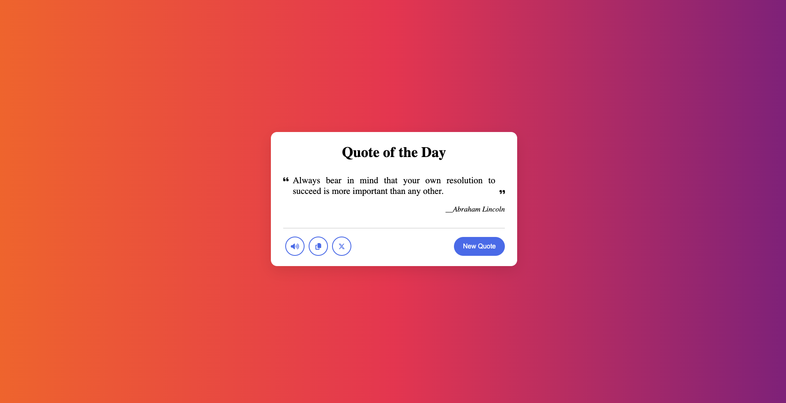

# Random Quote Generator using HTML, CSS, and JavaScript

This project is a simple web application that generates random quotes when the user clicks a button. It utilizes HTML for the structure, CSS for styling, and JavaScript for generating and displaying the quotes.

Live Demo: https://constgenius.github.io/RandomQuoteGenerator/

Demo:

